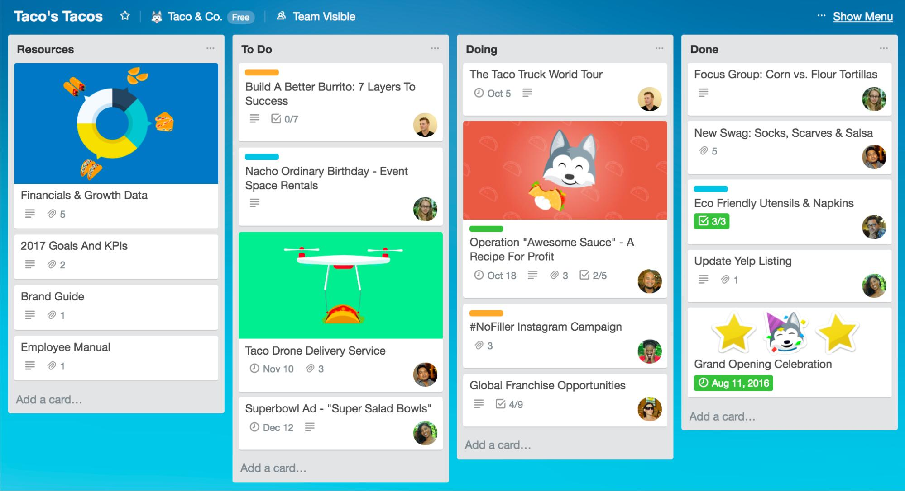

# micro2do

This is my pet project to learn microservices architecture.

## Description

*\*Trello example** 

The initial idea was to realize a todo app, but I decided to go further and to create something
similar to Trello or Notion application in its nature.

So I am going to start off a simple todo app and extend it with features like team boards, todo scheduling, todo estimation,
statistics on progress etc.

## Plan

1. Start with simple todo app
2. Extend it with various microservices

## Microservices

I am going to do microservices architecture from scratch, that's why
I need to make up wich services my app will have.

Right now I think of these:
- Todo service
- Auth Service
- Notification Service
- Data Upload Service
- Statistics Generator Service

It is not a full list, as it may be shortened or extended in the process.
